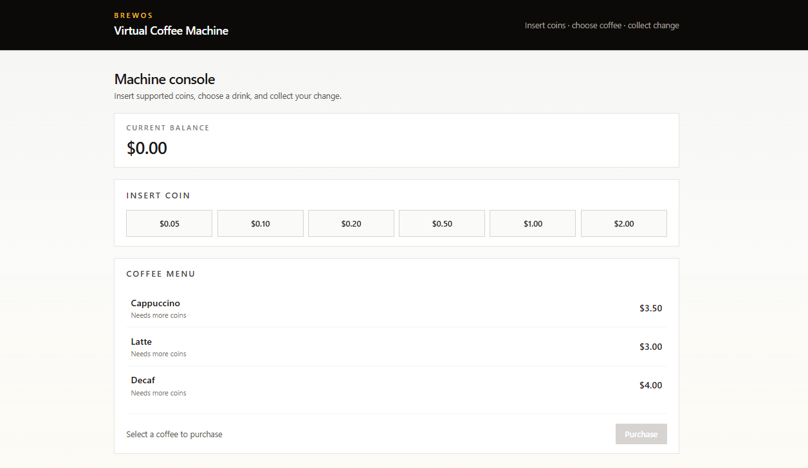
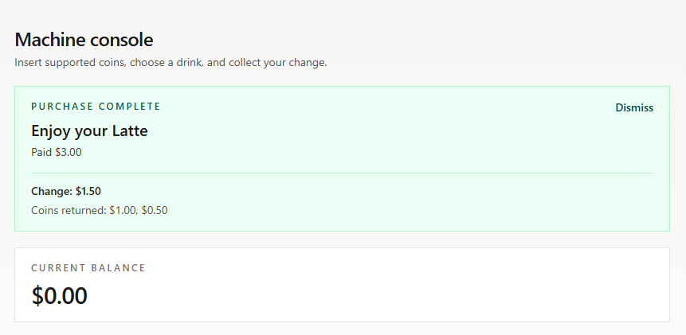

# BrewOS

Virtual coffee machine platform built for a senior-level full-stack technical assessment.

BrewOS allows users to insert supported coins, browse available drinks, purchase coffee, and receive calculated change.

The backend is implemented using .NET 8 with Clean Architecture principles. The frontend is a React + TypeScript SPA using React Query for server-state management.

The project focuses on maintainable architecture, separation of concerns, testability, and production-style API design.

---

# Repository

Source code:

https://github.com/ross552/BrewOS

---

# Features

- Coffee menu with multiple drink options
- Coin insertion with denomination validation
- Balance tracking
- Coffee purchase workflow
- Automatic greedy change calculation
- Domain-driven business rules
- Centralized API error handling
- React UI with loading, error, empty, and success states
- Accessible user interactions

---

# Architecture

## Overview

```
                         React SPA
                            |
                    React Query Hooks
                            |
                       Axios Client
                            |
                   ASP.NET Core Web API
                            |
                  Application Use Cases
                            |
                       Domain Layer
                            
```

---

# Backend Architecture

The backend follows Clean Architecture principles.

## Layer Responsibilities

| Layer | Responsibility |
|---|---|
| Domain | Core business rules, entities, value objects, and domain services |
| Application | Use cases, DTOs, orchestration, and business workflows |
| API | Controllers, dependency injection, middleware, Swagger, and CORS |
| Tests | Automated verification of domain, application, and API behavior |

---

# Frontend Architecture

The frontend follows a component-driven React architecture.

| Layer | Responsibility |
|---|---|
| Pages | Application screens and user workflows |
| Components | Reusable UI elements |
| Hooks | React Query queries and mutations |
| API Client | Centralized HTTP communication |
| Types | Shared TypeScript models |

---

# Dependency Rules

- Domain has no dependency on outer layers.
- Controllers contain only HTTP concerns.
- Business rules live inside Domain/Application layers.
- React components do not directly communicate with APIs.
- API communication is handled through hooks and clients.

---

# Technology Stack

## Backend

- .NET 8
- ASP.NET Core Web API
- Clean Architecture
- xUnit
- Swagger / OpenAPI

## Frontend

- React
- TypeScript
- Vite
- Tailwind CSS
- TanStack React Query
- Axios

---

# Repository Structure

```
BrewOS/
│
├── backend/
│   ├── BrewOS.sln
│   ├── BrewOS.Api/
│   ├── BrewOS.Application/
│   ├── BrewOS.Domain/
│   └── BrewOS.Tests/
│
├── frontend/
│   └── brewos-web/
│
└── README.md
```

---

# Running Locally

## Prerequisites

- .NET 8 SDK
- Node.js 20+

---

# Backend

Navigate to backend:

```bash
cd backend
```

Restore dependencies:

```bash
dotnet restore
```

Run API:

```bash
dotnet run --project BrewOS.Api
```

Backend URLs:

```
API:
http://localhost:5037

Swagger:
http://localhost:5037/swagger

Health Check:
GET /health
```

---

# Frontend

Navigate to frontend:

```bash
cd frontend/brewos-web
```

Install dependencies:

```bash
npm install
```

Run development server:

```bash
npm run dev
```

Frontend URL:

```
http://127.0.0.1:5173
```

Start the backend API before using the frontend application.

---

# Development Workflow

Typical development workflow:

1. Implement domain behavior first
2. Add application use cases
3. Expose functionality through API endpoints
4. Add automated tests
5. Integrate frontend components through API hooks
6. Validate the complete user workflow

The project emphasizes testable business rules, where core behavior is verified independently before UI integration.

---

# API Overview

Base URL:

```
http://localhost:5037
```

## Endpoints

| Method | Endpoint | Description |
|---|---|---|
| GET | `/api/coffees` | Retrieve available coffee menu |
| GET | `/api/machine/status` | Retrieve current machine balance |
| POST | `/api/machine/coins` | Insert validated coin |
| POST | `/api/machine/purchase` | Purchase selected coffee |

---

# API Examples

## Get Coffee Menu

Request:

```http
GET /api/coffees
```

---

## Insert Coin

Request:

```http
POST /api/machine/coins

Content-Type: application/json
```

Body:

```json
{
  "valueInCents": 200
}
```

Response:

```json
{
  "balanceInCents": 200
}
```

Supported denominations:

```
5, 10, 20, 50, 100, 200 cents
```

---

## Purchase Coffee

Request:

```http
POST /api/machine/purchase

Content-Type: application/json
```

Body:

```json
{
  "coffeeId": "22222222-2222-2222-2222-222222222222"
}
```

Coffee catalog:

| Coffee | ID | Price |
|---|---|---|
| Cappuccino | 11111111-1111-1111-1111-111111111111 | 350 cents |
| Latte | 22222222-2222-2222-2222-222222222222 | 300 cents |
| Decaf | 33333333-3333-3333-3333-333333333333 | 400 cents |

```

Successful purchase returns:

- Selected drink
- Paid amount
- Remaining balance
- Calculated change coins

---

# Error Handling

The API uses a consistent error response contract.

Example:

```json
{
  "code": "INSUFFICIENT_BALANCE",
  "message": "Insufficient balance",
  "timestamp": "2026-09-25T10:00:00Z"
}
```

Exception handling is centralized through middleware.

Supported error scenarios:

- Invalid requests
- Insufficient balance
- Missing resources
- Unexpected server errors
- API connectivity failures

The frontend maps these responses into clear user-facing messages.

---

# Testing

Run backend tests:

```bash
cd backend

dotnet test
```

Current result:

```
30 tests passing
```

Coverage areas:

| Area | Tested Behavior |
|---|---|
| Domain | Coin validation, change calculation, purchase rules |
| Application | Purchase workflow and use cases |
| API | Error contracts and middleware mappings |

Tests focus on business behavior and expected outcomes.

---

# Testing Strategy

The test suite follows the architecture boundaries.

## Domain Tests

Validate pure business rules:

- Supported coin validation
- Purchase rules
- Balance calculations
- Change calculation algorithm
- Machine reset behavior


## Application Tests

Validate application workflows:

- Successful purchase flow
- Unknown coffee handling
- Use case orchestration


## API Tests

Validate HTTP behavior:

- Error response contracts
- Exception mappings
- Correct status codes

The goal is to ensure business behavior remains reliable independently from delivery mechanisms.

---

# Design Decisions

## Clean Architecture

Business logic is isolated from HTTP concerns and external dependencies.

Benefits:

- Domain logic can be tested independently
- Controllers remain lightweight
- External dependency changes do not affect business rules

---

## React Query

React Query manages server state including:

- Coffee menu loading
- Machine status
- Coin insertion
- Purchase mutations

This avoids unnecessary global state while providing:

- Caching
- Loading states
- Error handling
- Mutation lifecycle management

---

## Centralized Error Handling

Backend exceptions are converted into a predictable API contract.

The frontend consumes this contract and displays appropriate feedback depending on the error type.

---

# Security Considerations

The application follows common API security practices:

- Input validation at API boundaries
- No business logic exposed through controllers
- Consistent error responses without leaking internal details
- Dependency injection for controlled service composition
- CORS configured explicitly for frontend access

Future production enhancements would include authentication, rate limiting, and audit logging.

---

# Current Limitations

This assessment implementation intentionally keeps scope focused.

Current limitations:

- Machine state is stored in memory
- No authentication system
- No external persistence layer
- Single machine instance per API process

---

# Future Improvements

Possible production extensions:

- Persistent storage for machine state
- Transaction history
- User accounts
- Distributed locking for concurrent purchases
- Automated frontend testing with Playwright
- Monitoring and observability integration

---

# Assessment Notes

This implementation intentionally prioritizes:

- Clean architecture over premature infrastructure complexity
- Testable business rules over framework coupling
- Clear API contracts over frontend assumptions
- Maintainable code structure over unnecessary abstractions

The current in-memory machine state is a deliberate trade-off for the assessment scope. The architecture allows persistence to be introduced later without changing domain behavior.

---

# Screenshots

## Coffee Machine Interface

The main BrewOS interface allows users to insert coins, view available drinks, and manage their current balance.




## Successful Purchase Flow

The purchase workflow displays the selected drink, payment details, and calculated change returned to the user.



---

# Summary

BrewOS demonstrates a production-style full-stack implementation using:

- .NET 8 Clean Architecture
- ASP.NET Core Web API
- React + TypeScript
- React Query
- Automated testing
- Centralized error handling
- Maintainable frontend architecture

The implementation keeps business rules isolated, APIs clean, and the application structured for future enhancements.